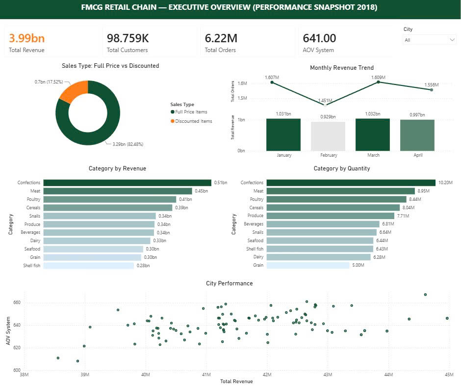

# Xây dựng Kho dữ liệu & Quy trình ETL cho ngành FMCG

## Thông Tin Tác Giả

* **Họ và tên:** Nguyễn Ngọc Huỳnh
* **Vai trò:** Data Engineer
* **Thời gian thực hiện:** Tháng 05/2026
* **Công cụ sử dụng:** SQL Server, Python, Power BI, Star Schema Data Modeling.
> **Nguồn dữ liệu:** Xóm Data | https://dataset.xomdata.com/datasets/schema/fmcg_sales | https://www.facebook.com/groups/1707916343455196

---

## 1. Kiến Trúc Dữ Liệu & Mô Tả Hệ Thống (Data Architecture & Metadata)

Dự án tập trung xây dựng **Hệ thống Kho dữ liệu (Data Warehouse)** và **Pipeline tự động hóa (ETL Pipeline)** cho chuỗi bán lẻ FMCG quy mô lớn. Hệ thống xử lý **~6.8 triệu dòng giao dịch** lịch sử snapshot 4 tháng, phục vụ nhu cầu làm sạch, biến đổi và tạo các **Data Marts** chuẩn hóa cho hệ thống Báo cáo Quản trị (Power BI). Hệ thống gồm 1 bảng sự kiện trung tâm (`fmcg_sales sales`), 6 bảng thứ nguyên (`fmcg_sales products, fmcg_sales employees, fmcg_sales customers, fmcg_sales cities, fmcg_sales countries, fmcg_sales categories`).

### Mục tiêu chính của Data Engineer:
* **Data Modeling:** Thiết kế Sơ đồ hình sao (Star Schema) tối ưu hóa truy vấn cho Fact Sales (6.8M rows) và 6 Dimension tables.
* **Data Quality Framework:** Xây dựng module Python tự động kiểm định tính toàn vẹn tham chiếu (Referential Integrity), phát hiện khóa ngoại gãy (Orphan Keys) và đo lường tỷ lệ dữ liệu khuyết thiếu (`NULL` Timestamps).
* **ETL & Transformation:** Viết pipeline Python (SQLAlchemy) trích xuất, biến đổi và tự động tổng hợp (Aggregate) dữ liệu thành các file Data Marts định dạng CSV/SQL Views cho bộ phận Analytics.
* **Operational Monitoring:** Xuất log vận hành tự động định dạng JSON ghi nhận lịch sử thực thi, chỉ số chất lượng và trạng thái pipeline (`SUCCESS`/`FAILED`).

### 1.1. Từ Điển Dữ Liệu Chi Tiết (Data Dictionary)

#### Bảng `fmcg_sales sales` (Fact Table - Bảng Sự Kiện Doanh Số)
*Lưu trữ 6.8M dòng giao dịch lịch sử bán hàng chi tiết.*

| Tên Cột (Column Name) | Kiểu Dữ Liệu (Data Type) | Cho Phép NULL | Mô Tả Ý Nghĩa (Description) |
| :--- | :--- | :---: | :--- |
| `sales_id` | Int64 / Primary Key | NO | Mã định danh duy nhất của dòng giao dịch. |
| `salesperson_id` | Int64 / Foreign Key | YES | Mã nhân viên thu ngân/bán hàng (liên kết sang `fmcg_sales employees`). |
| `customer_id` | Int64 / Foreign Key | YES | Mã khách hàng mua hàng (liên kết sang `fmcg_sales customers`). |
| `product_id` | Int64 / Foreign Key | YES | Mã sản phẩm (liên kết sang `fmcg_sales products`). |
| `quantity` | Int64 | YES | Số lượng sản phẩm tiêu thụ trên đơn hàng. |
| `discount` | Decimal | YES | Tỷ lệ chiết khấu giảm giá (0 - 1). |
| `total_price` | Decimal /  | NO | Tổng giá trị thực thu của dòng sản phẩm sau chiết khấu ($). |
| `sales_date` | Date / Foreign Key | NO | Ngày phát sinh giao dịch (liên kết sang `Dim_Date[Date]`). |
| `transaction_number` | NVarchar(25) | YES | Mã số hóa đơn / mã giao dịch. |

---

#### Các Bảng Thứ Nguyên (Dimension Tables)

##### 1. Bảng `fmcg_sales products` (452 dòng - Danh Mục Sản Phẩm)
| Tên Cột (Column Name) | Kiểu Dữ Liệu (Data Type) | Cho Phép NULL | Mô Tả Ý Nghĩa (Description) |
| :--- | :--- | :---: | :--- |
| `product_id` | Int64 / Primary Key | NO | Mã sản phẩm duy nhất. |
| `product_name` | NVarchar(45) | NO | Tên SKU sản phẩm chi tiết. |
| `price` | Decimal | YES | Đơn giá niêm yết nguyên giá ($). |
| `category_id` | Int64 / Foreign Key | YES | Mã ngành hàng (liên kết sang `fmcg_sales categories`). |
| `product_class` | NVarchar(15) | YES | Phân loại đẳng cấp sản phẩm. |
| `vitality_days` | Int64 | YES | Số ngày vòng đời / Tốc độ xoay vòng kho của SKU. |
| `modify_date` | DateTime2 | YES | Ngày cập nhật thông tin sản phẩm. |
| `resistant` | NVarchar(15) | YES | Khả năng bảo quản / độ bền sản phẩm. |
| `is_allergic` | NVarchar(20) | YES | Cảnh báo thành phần gây dị ứng. |

##### 2. Bảng `fmcg_sales categories` (11 dòng - Nhóm Ngành Hàng)
| Tên Cột (Column Name) | Kiểu Dữ Liệu (Data Type) | Cho Phép NULL | Mô Tả Ý Nghĩa (Description) |
| :--- | :--- | :---: | :--- |
| `category_id` | Int64 / Primary Key | NO | Mã nhóm ngành hàng duy nhất. |
| `category_name` | NVarchar(45) | NO | Tên ngành hàng (Confections, Meat, Grain,...). |

##### 3. Bảng `fmcg_sales customers` (98.8K dòng - Khách Hàng)
| Tên Cột (Column Name) | Kiểu Dữ Liệu (Data Type) | Cho Phép NULL | Mô Tả Ý Nghĩa (Description) |
| :--- | :--- | :---: | :--- |
| `customer_id` | Int64 / Primary Key | NO | Mã định danh khách hàng duy nhất. |
| `first_name` | NVarchar(45) | YES | Tên của khách hàng. |
| `middle_initial` | NVarchar(1) | YES | Tên lót viết tắt. |
| `last_name` | NVarchar(45) | YES | Họ của khách hàng. |
| `city_id` | Int64 / Foreign Key | YES | Mã thành phố sinh sống (liên kết sang `fmcg_sales cities`). |
| `address` | NVarchar(90) | YES | Địa chỉ nhà riêng khách hàng. |

##### 4. Bảng `fmcg_sales employees` (23 dòng - Nhân Viên Thu Ngân)
| Tên Cột (Column Name) | Kiểu Dữ Liệu (Data Type) | Cho Phép NULL | Mô Tả Ý Nghĩa (Description) |
| :--- | :--- | :---: | :--- |
| `employee_id` | Int64 / Primary Key | NO | Mã nhân viên duy nhất. |
| `first_name` | NVarchar(45) | YES | Tên nhân viên. |
| `middle_initial` | Nvarchar(1) | YES | Tên lót viết tắt. |
| `last_name` | NVarchar(45) | YES | Tên nhân viên. |
| `birth_date` | Date | YES | Ngày tháng năm sinh. |
| `gender` | NVarchar(10) | YES | Giới tính. |
| `hire_date` | DateTime2 | YES | Ngày bắt đầu vào làm việc tại chuỗi. |
| `city_id` | Int64 / Foreign Key | YES | Mã thành phố làm việc. |

##### 5. Bảng `fmcg_sales cities` (96 dòng - Thành Phố)
| Tên Cột (Column Name) | Kiểu Dữ Liệu (Data Type) | Cho Phép NULL | Mô Tả Ý Nghĩa (Description) |
| :--- | :--- | :---: | :--- |
| `city_id` | Int64 / Primary Key | NO | Mã thành phố. |
| `city_name` | NVarchar(45) | NO | Tên thành phố phân phối (Tucson, Jackson,...). |
| `zipcode` | NVarchar(10) | YES | Mã bưu chính. |
| `country_id` | Int64 / Foreign Key | YES | Mã quốc gia (liên kết sang `fmcg_sales countries`). |

##### 6. Bảng `fmcg_sales countries` (206 dòng - Quốc Gia)
| Tên Cột (Column Name) | Kiểu Dữ Liệu (Data Type) | Cho Phép NULL | Mô Tả Ý Nghĩa (Description) |
| :--- | :--- | :---: | :--- |
| `country_id` | Int64 / Primary Key | YES | Mã quốc gia duy nhất. |
| `country_name` | NVarchar(45) | NO | Tên quốc gia. |
| `country_code` | Nvarchar(2) | YES | Mã quốc gia 2 ký tự (ISO Code). |

---
### 1.2. Mối Quan Hệ Giữa Các Bảng (Entity-Relationship Diagram)

Hệ thống thiết lập các mối quan hệ vật lý **Một - Nhiều ($1 : \infty$)** chuẩn hóa lọc một chiều (Single-direction filtering) từ Bảng Thứ Nguyên sang Bảng Sự Kiện:

1. **Luồng dữ liệu Bán hàng Trung tâm (Fact - Sales):**
   * `fmcg_sales products[product_id]` ($1$) $\rightarrow$ `fmcg_sales sales[product_id]` ($\infty$) *(Active)*
   * `fmcg_sales customers[customer_id]` ($1$) $\rightarrow$ `fmcg_sales sales[customer_id]` ($\infty$) *(Active)*
   * `fmcg_sales employees[employee_id]` ($1$) $\rightarrow$ `fmcg_sales sales[salesperson_id]` ($\infty$) *(Active)*

2. **Luồng Chuẩn hóa Phân cấp (Snowflake Hierarchy):**
   * `fmcg_sales categories[category_id]` ($1$) $\rightarrow$ `fmcg_sales products[category_id]` ($\infty$) *(Active)*
   * `fmcg_sales countries[country_id]` ($1$) $\rightarrow$ `fmcg_sales cities[country_id]` ($\infty$) *(Active)*
   * `fmcg_sales cities[city_id]` ($1$) $\rightarrow$ `fmcg_sales customers[city_id]` ($\infty$) *(Active)*
   * `fmcg_sales cities[city_id]` ($1$) $\dashrightarrow$ `fmcg_sales employees[city_id]` ($\infty$) *(Inactive Relationship - Nét đứt)*
---

## 2. Quy Trình Kỹ Thuật Dữ Liệu & Pipeline (Data Engineering Workflow)
Hệ thống pipeline được xây dựng theo mô hình 4 Tầng Kiến Trúc (4-Tier Architecture) bằng Python OO-Design kết hợp với SQL Server Engine, hỗ trợ kiểm định dữ liệu tự động, biến đổi nâng cao và xuất Data Marts phục vụ downstream BI.

```text
[SQL Server OLTP]
       │
       ▼
[Tầng 1: Configuration & Database Connection] (SQLAlchemy Engine / PyMSSQL)
       │
       ▼
[Tầng 2: Automated Data Quality Audit Framework]
       ├── Check 1: NULL Timestamp Audit (Threshold < 5.0%)
       └── Check 2: Referential Integrity & Orphan FK Checks
       │
       ▼
[Tầng 3: Data Transformation & Data Mart Building] (SQL Aggregate & In-Database Pushdown)
       │
       ▼
[Tầng 4: Logging, Alerting & File Export] ──► [data_marts/monthly_category_summary.csv]
                                         └──► [logs/data_quality_report.json]
```
                   
#### 2.1. Mã Nguồn Pipeline Python
* Toàn bộ luồng xử lý ETL và Data Quality được đóng gói trong file etl_pipeline.py.
Báo Cáo Kiểm Định Tự Động & Monitoring System
#### 2.2. Báo Cáo Kiểm Định Tự Động & Monitoring System (logs/data_quality_report.json)
* Mỗi lần pipeline chạy, hệ thống tự động ghi nhận nhật ký vận hành vào file JSON để phục vụ việc giám sát tự động
#### 2.3. Xử lý dữ liệu 
* **Làm sạch dữ liệu:**
  * Kiểm tra 67,526 dòng bị khuyết (chiếm 1.0% tổng giao dịch).
* **Kỹ thuật Window Function & Phân khúc Khách hàng Dynamic:**
  * Phân loại 98,759 khách hàng thành 4 nhóm Tứ phân vị (VIP, Medium-High, Medium-Low, Low Spenders).
  * Giám sát kỷ luật trần chiết khấu 3.00% cho 23 thu ngân bằng cách tính toán Rolling Discount Average.
* **Chẩn Đoán Biến Động MoM & Tooltip Ranking (sql/product_inventory_deepdive.sql):**
  * Lọc ra Top 5 SKUs bán chạy nhất từng ngành hàng cho tính năng Tooltip trên Power BI.

---

## 3. Kiến Trúc Hệ Thống Báo Cáo Chiến Lược (Dashboard Purpose & Business Value)

Hệ thống báo cáo được thiết kế theo tư duy phân tầng thông tin quản trị (**Top-down Approach**), đi từ bức tranh tài chính tổng quan vĩ mô đến các góc nhìn bóc tách chi tiết theo thực tế vận hành.

---

### Trang 1: FMCG Retail Chain — Executive Overview



#### A. Mục đích chiến lược
* Cung cấp một góc nhìn toàn cảnh tức thời (At-a-glance) về "sức khỏe" tài chính, quy mô đơn hàng và chỉ số dòng tiền cốt lõi của toàn hệ thống bán lẻ.
* Đóng vai trò là công cụ giám sát cấp cao dành cho Ban Giám Đốc (CEO/CFO), giúp phát hiện sớm các tín hiệu bất thường hoặc điểm gãy đột ngột của doanh số theo chuỗi thời gian.

#### B. Trang này làm những gì?
* **Theo dõi & hợp nhất 4 chỉ số sinh mệnh:** Doanh thu ($3.99Bn USD), Khối lượng đơn hàng (6.22M đơn), Giá trị đơn hàng trung bình (AOV $641.00 USD) và Quy mô tệp khách hàng (98,759 người).
* **Kiểm định chất lượng dòng tiền (Sales Type Analysis):** Bóc tách tỷ trọng giữa dòng tiền nguyên giá (Full Price Items) và dòng tiền từ sản phẩm khuyến mãi (Discounted Items).
* **Phân rã cơ cấu danh mục & vị thế địa lý:** Phân tích song song Doanh thu vs Sản lượng của 11 ngành hàng và định vị hiệu suất AOV vs Doanh thu của 96 thành phố trên Ma trận Scatter Plot (City Performance).

#### C. Ý nghĩa kinh doanh
* **Khẳng định độ bền vững của thương hiệu:** Phơi bày thực tế chất lượng dòng tiền khi **82.48% doanh thu ($3.29Bn USD)** đến từ hàng nguyên giá. Ý nghĩa dữ liệu khẳng định chuỗi bán lẻ có sức hút tự nhiên rất lớn, tăng trưởng lành mạnh và không bị phụ thuộc vào các chương trình xả hàng giảm giá.
* **Định vị thị trường ngôi sao để tối ưu hóa biên lợi nhuận:** Phát hiện **Tucson** dẫn đầu toàn chuỗi về quy mô sản lượng (**214.53K sản phẩm**), trong khi **Jackson** lập kỷ lục AOV cao nhất chuỗi (**$667.19 USD/đơn**). Kết quả này giúp khoanh vùng các thị trường trọng điểm để phân bổ nguồn lực bán hàng và triển khai các gói sản phẩm độc quyền.

---

### Trang 2: FMCG Retail Chain — Product & Inventory Performance (Tối Ưu Danh Mục & Chuỗi Cung Ứng)


#### A. Mục đích chiến lược
* Bản đồ hóa và chẩn đoán chuyên sâu hiệu suất danh mục sản phẩm kết hợp với tốc độ lưu kho (**Vitality Days**).
* Cung cấp công cụ điều phối tồn kho chính xác tới cấp độ SKU cho phòng Logistics & Mua hàng, giải mã tận gốc nguyên nhân biến động doanh thu theo từng tháng.

#### B. Trang này làm những gì?
* **Kiểm toán hiệu suất cấu trúc giá:** Đối chiếu trực diện giữa đơn giá trung bình (Avg Unit Price) và tổng doanh thu để tìm ra nghịch lý đóng góp dòng tiền.
* **Định vị ma trận lưu kho:** Phân định 11 ngành hàng lên Ma trận 4 ô (*Winners, Stable Pillars, High-risk, Hidden Gems*) dựa trên hai trục: Doanh thu và Tốc độ xoay vòng kho (Vitality Days).
* **Điều hướng nhu cầu địa phương linh hoạt (Geographic Market Demand):** Tích hợp bộ lọc tương tác **Top 10 / Bottom 10** gán kèm **Report Page Tooltip** tự động soi **Top 5 SKUs** cốt lõi cho từng thành phố.
* **Chẩn đoán biến động MoM:** Bóc tách chênh lệch doanh thu và sản lượng giữa tháng hiện tại và tháng liền trước ở cấp độ ngành hàng.

#### C. Ý nghĩa kinh doanh
* **Giải mã bản chất cú sụt giảm Tháng 2 (-$101.53M USD):** Bảng chẩn đoán MoM phơi bày nguyên nhân giảm sâu ở Tháng 2 đến từ 2 ngành gánh team: Confections (-$13.79M USD) và Meat (-$11.77M USD). Việc Tháng 3 bật tăng trở lại trọn vẹn (+$102.99M USD) chứng minh đây là **Tắc nghẽn chuỗi cung ứng cục bộ / Cháy hàng (Out-of-Stock)** chứ doanh nghiệp hoàn toàn không bị mất thị phần hay mất khách hàng.
* **Tối ưu hóa vốn lưu động & chống cháy hàng cục bộ:** Chỉ ra chính xác các mặt hàng cần bơm thêm Quota nhập kho tại các thành phố sức mua lớn (Tucson, Jackson), đồng thời cho phép phòng Logistics mạnh tay điều chuyển các mã hàng ứ đọng ở nhóm Hidden Gems (Grain - lưu kho > 35-40 ngày) khỏi các thị trường yếu (Omaha).

---

### Trang 3: FMCG Retail Chain — Customers & Employees Health (Sức Khỏe Khách Hàng & Kỷ Luật Vận Hành)


#### A. Mục đích chiến lược
* Đánh giá mức độ gắn kết dài hạn của tệp khách hàng (Customer Retention) kết hợp với việc kiểm soát kỷ luật vận hành và năng suất bán hàng của đội ngũ nhân sự tuyến đầu (23 Thu ngân/Sales).
* Đảm bảo bộ máy vận hành bên dưới tuân thủ nghiêm túc các quy chuẩn kinh doanh, triệt tiêu rủi ro thất thoát dòng tiền từ các điểm bán lẻ.

#### B. Trang này làm những gì?
* **Đo lường độ ổn định tệp thành viên (Membership Stability):** Giám sát biến động số lượng đơn hàng song song với đường quy mô khách hàng Active theo từng tháng.
* **Phân khúc giá trị khách hàng (Customer Value Segmentation):** Phân chia tệp 98.759K khách hàng thành 4 nhóm Tứ phân vị chi tiêu (*High Spenders VIP, Medium-High, Medium-Low, Low Spenders*).
* **Kiểm toán năng suất & thâm niên nhân sự (Employee Productivity vs Tenure):** Đối chiếu Doanh số Rolling 30 ngày với Số ngày làm việc (Tenure Days) của 23 nhân viên kinh doanh.
* **Giám sát kỷ luật chiết khấu thu ngân (Cashier Discount Compliance):** Đo lường chi tiết tỷ lệ discount thực tế áp dụng tại ca làm việc của từng thu ngân so với trần quy định 3.00%.

#### C. Ý nghĩa kinh doanh
* **Xác nhận trạng thái Zero Churn Rate:** Dữ liệu chỉ ra dù sản lượng Tháng 2 giảm, **đường quy mô khách hàng Active vẫn nằm ngang tuyệt đối ở mốc 98,759 người (~99K)** qua cả 4 tháng. Điều này khẳng định 100% khách hàng không quay lưng với chuỗi, sụt giảm doanh số hoàn toàn do nhịp mua hàng tạm thời.
* **Khẳng định năng lực quy chuẩn hóa bộ máy (Standardized Operations):** Biểu đồ Năng suất cho thấy dù thâm niên từ 500 đến 3,000 ngày, doanh số đóng góp của 23 nhân viên đều nằm ngang ở dải tiệm cận **$30M USD/người**. Ý nghĩa chứng minh quy trình đào tạo và vận hành ca bán hàng cực kỳ xuất sắc.
* **Kiểm soát rủi ro gian lận tài chính:** Tỷ lệ giảm giá của 23 thu ngân dao động chỉ từ **2.977% đến 3.026%** (trần mốc 3.00%), chứng minh đội ngũ thu ngân chấp hành kỷ luật chiết khấu 100%, không có hiện tượng lạm dụng voucher khuyến mãi gây rò rỉ lợi nhuận.
